# Predicting Credit Risk With Machine Learning
***_Project Goal:_*** To test several machine learning techniques to accurately classify high and low risk borrowers.

## Credit Risk Resampling
***

In this notebook I tested 4 algorithms and then compared their results at accurately predicting high and low risk borrowers.

### Algorithms
Algorithms used

1. Oversample the data using the Naive Random Oversampler and SMOTE algorithms.
2. Undersample the data using the Cluster Centroids algorithm.
3. Over- and undersample using a combination SMOTEENN algorithm.

### Process
For each algorithm I followed the process below:
1. Train a logistic regression classifier from sklearn.linear_model using the resampled data.
2. Calculate the balanced accuracy score from sklearn.metrics.
3. Calculate the confusion matrix from sklearn.metrics.
4. Print the imbalanced classification report from imblearn.metrics.

### Results
***

#### **Simple Logistic Regression Model:**

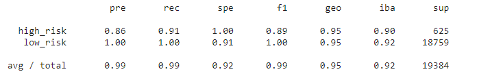

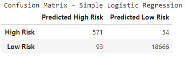
***

#### **Naive Random Oversampling Model:**
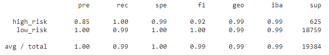

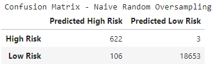
***

#### **SMOTE Oversampling Model:**
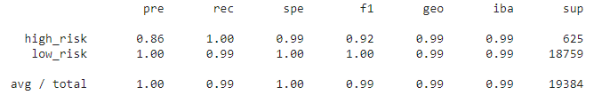

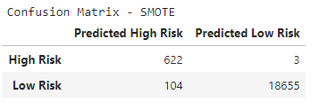
***
#### **Cluster Centroids Undersampling Model:**
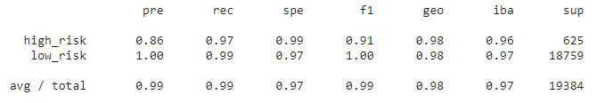

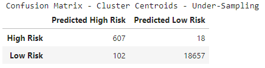
***
#### **SMOTEENN Combination Over-Under-Sampling Model:**
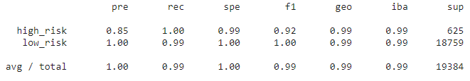

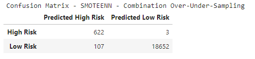
***

***Which model had the best balanced accuracy score?***

* Simple Logistic Regression = 0.9543211898288821
* Naive Random Oversampling = 0.9947746894823818
* SMOTE Oversampling = 0.9948279972279972
* Cluster Centroids (Undersampling) = 0.9948279972279972
* SMOTEENN (combination under-over-sampling) = 0.994748035609574

The SMOTE oversampling and the Cluster Centroids Undersampling models had the best balanced accuracy scores.

***Which model had the best recall score?***

As you can see from the confusion matrices above, the Naive Random Oversampling, SMOTE, and SMOTEENN models all had the best recall scores. The models had just 3 false negatives and accurately predicted 622 of the 625 high risk borrowers.

***Which model had the best geometric mean score?***

Based on the Geometric Mean Score the Naive Random Oversampling, SMOTE Oversampling and the SMOTEENN algorithms scored the best with 99% for both high and low risk borrowers.

## Ensemble Learning
***

### Results:

**Balanced Random Forest Classifier Model:**

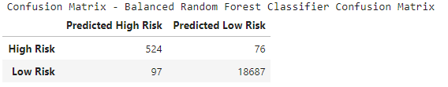
***

**Easy Ensemble Classifier Model:**

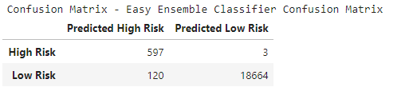
***

### Conclusions:

***Which model had the best balanced accuracy score?***
* Balanced Random Forest Classifier Model = 0.9340846819988642
* Easy Ensemble Classifier Model = 0.9943057921635434

The Easy Ensemble Classifier model had the best Balanced Accuracy Score, among the two ensemble algorithms.

***Which model had the best recall score?***

The Easy Ensemble algorithm also had a better recall score. For High risk borrowers it predicted 99% vs. 87% for the Random Forest algorithm, while for low risk borrowers both algorithms had a recall score of 99%.

***Which model had the best geometric mean score?***

Once again, the Easy Ensemble algorithm also had a better geometric mean score (99% for both high and low risk borrowers).

***What are the top three features for the Balanced Random Forest Classifier Model?***

See the chart below for the features importance chart for the Balanced Random Forest Model:

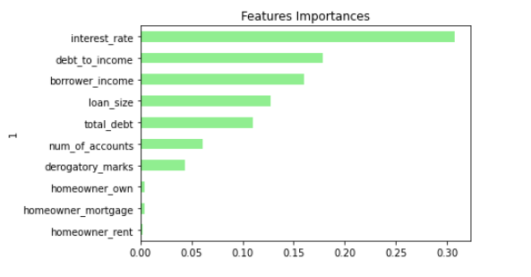